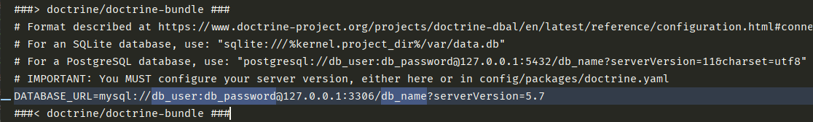
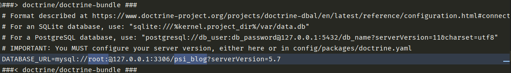

# P2
New PABD

## Blog
Pentru a putea testa sistemul de blog, trebuie urmati urmatorii pasi:
##### 1. Se creeaza o baza de date locala cu denumirea ***psi_blog***
##### 2. Se modifica fisierul ***.env*** din root-ul proiectului

###### 2.1. *db_user* se refera la userul atasat bazei de date. In cazul nostru *root*.
###### 2.2. *db_password* se refera la parola userului. In cazul nostru lasam acest camp gol.
###### 2.3. *db_name* se refera la numele bazei de date. In cazul nostru *psi_blog*.

##### 3. Rulam comenzile *php bin/console make:migration* si *php bin/console doctrine:migrations:migrate* pentru a migra tabelele aferente blogului nostru in noua baza de date creata.